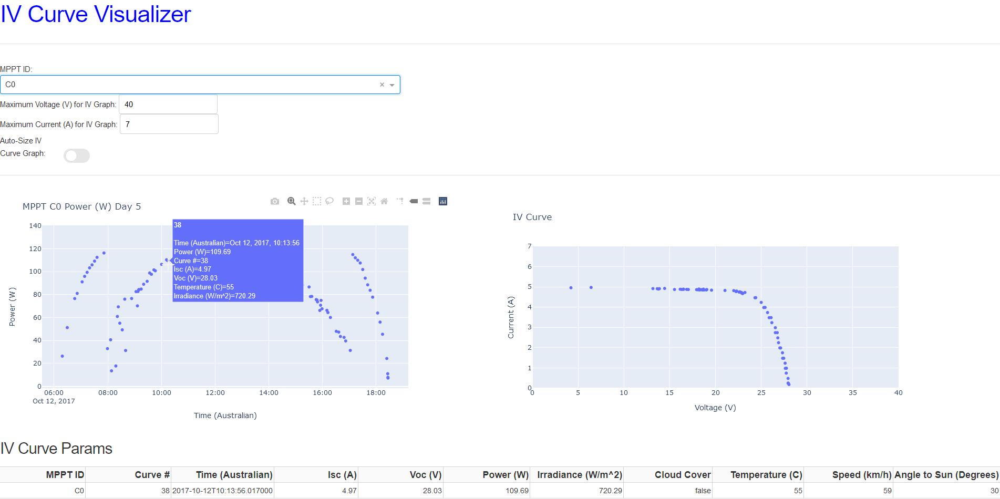

# IV Curve Visualization

This repo tracks development of code that makes IV curve visualization easier. It uses data from the Stanford Solar Car
Project's 2017 car, Sundae, from the 5th day of the World Solar Challenge. 
 
It takes in a dataframe full of IV data with columns 'voltage', 'current', 'power',  'time',
and 'mppt_id', and then displays it. It first scrapes the data to generate a new dataframe called iv_params that has
one row per IV curve containing all the relevant data for that IV curve. Then, it creates a Dash layout containing a
few useful tools to visualize the data.

How to use this: select which MPPT you want to use with the dropdown, then hover over any of the datapoints in the
power-time graph on the left to pull up that datapoints IV curve on the right. The hoverdata has customizable data that
should summarize the important characteristics of the IV curve. The full one-row entry for that IV curve is displayed
in the table at the bottom.

This is accomplished through Dash, a Python library that allows you to set up Plotly to easily make data dashboards.
The layout contains Python code that outputs HTML code referencing a stylesheet in the 'assets' folder. The callbacks
determine the interactivity and have all the code for creating the graphs.

Files:
* 01_EDA.ipynb: Exploratory Data Analysis on the Sundae data to get it into the right format 
(I did all the original analysis in Matlab and don't have a license anymore)
* 02_Dash_Graphs.py: A simple dashboard made with Dash. The minimum viable product for this, which has a very high value
per time invested. 
* 03_Semi-Final_Graphs.py: A dashboard with some extra functionality that looks nicer. Probably good enough to deliver
to other engineers outside my direct team, but not fully polished yet. However, further work is time-consuming enough that 
I only plan to return to this if I start planning to make dashboards for the public. 

## Dashboard image:

TODO:
0. ~~Set up virtual environment~~
1. ~~Gather data that we want to use (Ice Cream Sundae IV Curves)~~
2. ~~Define a way to index and access IV data~~
3. ~~Load data and graph it~~
4. ~~Make graphs look pretty!~~
5. Lookup documentation libraries and use them for documentation
6. Lookup unit test libraries and set up unit tests
7. Document how I set up unit tests, and collect resources on them. 
8. ~~Freeze environment to make a requirements.txt file~~
